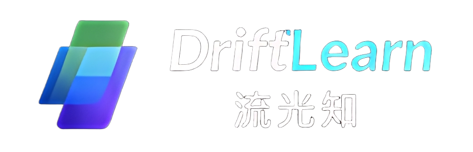

  

# DriftLearn 流光知

**让走神的时间，也能学到一点。**

> Team IF **Studio** 
> 2026年抖音黑客松南方科技大学站参赛项目demo 
> 2026年抖音黑客松南方科技大学站 Track3三等奖 最佳观众人气奖 

DriftLearn 流光知是一款面向 ADHD 特质用户、注意力容易漂移的学习者，以及想学习但容易被短视频吸引的人群的碎片化学习工具。

我们关注一个很常见的场景：
你本来正在背单词，只想打开短视频放松一下，却不知不觉刷了很久。等反应过来时，单词没背完，时间也已经过去了。

DriftLearn 不试图强迫你立刻退出娱乐，而是在你刷短视频的过程中，自然穿插轻量的单词学习卡片，让你在信息流里也能顺手记一个词、看一句例句、完成一次小小的学习。

---

## 这个产品适合谁？

DriftLearn 流光知适合：

* 学习时容易走神的人
* 想背单词但很难坚持的人
* 经常“刷一会儿就回去学习”，但最后停不下来的人
* ADHD 特质用户或注意力容易漂移的用户
* 希望用更轻松方式积累词汇的学习者

你不需要一次学习很久，也不需要强迫自己立刻进入高强度专注状态。
我们希望让学习以更低压力的方式，重新出现在你已经打开的信息流里。

---

## 核心功能

### 1. 短视频信息流学习卡片

当用户进入短视频浏览场景后，系统会在合适的间隔自然插入单词学习卡片。

它不会像普通学习软件一样要求你主动打开、主动打卡，而是在你已经开始刷视频时，轻轻提醒你：

> 还可以顺手学一点。

---

### 2. 轻量单词学习

每张学习卡片会展示一个单词及相关内容，例如：

* 单词
* 中文释义
* 英文例句
* 发音提示
* 简单记忆互动

用户可以快速浏览，也可以完成一次简单记忆。
学习过程不重、不压迫，更像是在刷视频中顺手完成一个小任务。

---

### 3. 微小成就反馈

DriftLearn 希望减少“我又浪费时间了”的内疚感。

即使你只记住了一个单词，也是一点真实的积累。
系统会通过轻量反馈，让用户感受到：

> 我没有完全放弃学习，我还是完成了一点。

---

## 使用方式

1. 用户进入短视频信息流场景
2. 正常浏览视频内容
3. 系统在信息流中自然插入单词学习卡片
4. 用户查看单词、释义、例句或发音
5. 完成一次轻量学习后，可以继续浏览
6. 学过的内容会被记录，方便后续复习

---

## 我们想解决什么问题？

DriftLearn 想解决的不是“用户不想学习”，而是：

> 用户想学，但很难持续控制自己的注意力。

很多人并不是讨厌学习，而是在疲惫、走神或想放松时，很容易被短视频吸引。
当娱乐时间失控后，用户常常会陷入：

> 娱乐沉迷 → 放弃学习 → 深度内疚

DriftLearn 希望打破这个循环。

我们不希望用强制、惩罚或高压提醒来逼用户学习，而是顺着用户原本的注意力流动，让知识自然出现在信息流里，把原本流失的碎片时间转化成低压力的学习体验。

---

## 典型使用场景

晚上，你本来正在背单词。
学了一会儿之后有点累，就打开短视频软件，想着：

> “看两个视频就回去。”

但一个视频接着一个视频，你又告诉自己：

> “这个刷完就回去。”
> “再看一个。”

等你反应过来时，时间已经过去很久，单词却还没有背完。

这时，DriftLearn 会在信息流中插入一张学习卡片。
你不需要退出当前场景，也不需要重新打开学习软件，只需要顺手看一眼，就能完成一次小小的学习。

---

## 产品理念

DriftLearn 流光知相信：

* 学习不一定只能发生在专注模式里
* 走神的人也不应该被简单地指责为“不自律”
* 对注意力容易漂移的人来说，降低切换成本很重要
* 微小的学习成就，也能帮助用户重新建立信心

我们希望做的不是一个更严格的学习工具，而是一个更温和的学习入口。

---

## 注意事项

DriftLearn 流光知不是医疗产品，也不提供 ADHD 诊断或治疗建议。
它是一款面向注意力管理和碎片化学习场景的辅助工具。

如果你正在经历严重的注意力困扰、学习障碍或情绪压力，建议寻求专业人士的帮助。

---

## 未来计划

后续我们希望继续完善：

* 更自然的信息流卡片出现机制
* 更适合不同用户的单词推荐
* 学习记录与复习功能
* 更低打扰的交互体验
* 面向 ADHD 特质用户的可用性测试
* 更多学习内容类型，如短句、听力、知识点卡片等

---

## 项目愿景

DriftLearn 流光知希望让学习不再只依赖强迫式专注。

当你已经被信息流吸引时，知识也可以轻轻出现。
哪怕只学到一个单词，也比完全放弃学习多了一点可能。

**把走神，变成一次微小的学习。**
